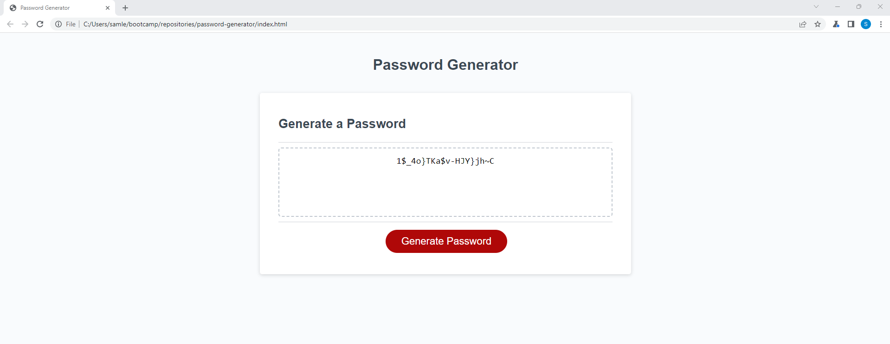

# <password-generator>

## Description

This was a project that was created with an emphasis on Javascript. The premise of the project was to create a webpage that will be able to generate a random string of characters that would potentially be utilized as a password. The randomly generated password can be customized by string length, and if the password includes uppercase letters, lowercase letters, numbers, and/or special characters. Additionally this project also demonstrates Javascript coding, on how to create an interactive webpage that displays outputs depending on a user’s input.

## Installation

This webpage can be viewed by accessing the following webpage URL:

https://samlee088.github.io/password-generator/

Additionally the supporting documents for this project can be accessed through Github:

https://github.com/samlee088/password-generator

## Usage

The webpage can be used by clicking on the ‘Generate Password’ button and following the prompts. 
Selecting the length of the password
The input must be selected from the following range (inclusive) [8-128]
Select wither uppercase letters may be used to generate the password
Select wither lowercase letters may be used to generate the password
Select wither numbers may be used to generate the password
Select wither special characters may be used to generate the password

Additional Notes
Please note that due to the passwords being randomly generated, it may be possible that one of the selected characters from the user selection may not be included. If this occurs, please generate a new password
There are no limitations on repeatable characters

## License
NA
